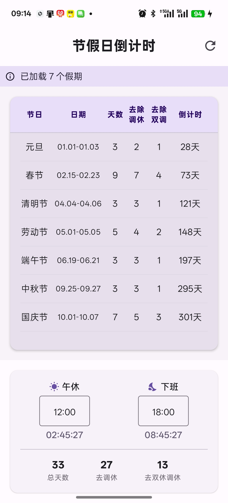

# HolidayCountdown-Android (假期倒计时 Android 版)

这是一个基于 Jetpack Compose 开发的中国法定节假日倒计时 Android 应用。它是 [Holiday-Countdown](https://github.com/shuyz/Holiday-Countdown) (Python版) 的 Android 移植版本，完美复刻了原版的核心功能与算法。


## ✨ 主要功能

*   **📅 节假日倒计时**：精准显示距离下一个假期的天数，支持“进行中”状态显示。
*   **📊 详细统计**：
    *   显示假期起止日期及总天数。
    *   **智能排除调休**：自动识别补班/调休，计算实际放假天数。
    *   **去双休统计**：进一步排除假期内的周末，计算纯工作日减免天数。
*   **⏱️ 下班倒计时**：
    *   支持自定义“午休”和“晚上下班”时间。
    *   实时倒计时显示。
*   **🔔 通知栏常驻**：前台服务保活，在通知栏实时更新倒计时，无需打开 App 即可查看。
*   **💾 离线与缓存**：
    *   **智能缓存**：成功下载一次数据后，无网也能使用。
    *   **预置数据**：内置兜底数据，安装即用，无需首次联网。
    *   **自动更新**：每次启动尝试获取最新假期安排（GitHub ICS 源）。

## 🛠️ 技术栈

*   **语言**：Kotlin
*   **UI 框架**：Jetpack Compose (Material Design 3)
*   **异步处理**：Kotlin Coroutines (协程)
*   **网络请求**：OkHttp
*   **日期处理**：`java.time` (ThreeTenABP / Desugaring)
*   **架构**：MVVM (Repository Pattern)

## 📦 编译与运行

1.  **环境要求**：Android Studio Ladybug 或更新版本，JDK 17+。
2.  **打开项目**：选择 `HolidayCountdown/Android` 目录打开。
3.  **同步 Gradle**：等待依赖下载完成。
4.  **运行**：连接 Android 设备或模拟器（推荐 Android 8.0+，最低支持 Android 7.0）。

## 📂 项目结构

```text
app/src/main/
├── assets/                 # 预置 ICS 数据 (holidayCal.ics)
├── kotlin/com/example/holiday/
│   ├── data/               # 数据层 (ICS解析, Repository, Holiday模型)
│   ├── service/            # 前台服务 (CountdownService)
│   ├── ui/                 # 界面层 (MainScreen, Compose组件)
│   └── MainActivity.kt     # 入口 Activity
└── AndroidManifest.xml     # 清单文件 (权限声明)
```

## 📝 发布与贡献

本项目遵循开源协议，欢迎提交 Issue 或 Pull Request。
ICS 数据源默认使用：`https://www.shuyz.com/githubfiles/china-holiday-calender/master/holidayCal.ics`
